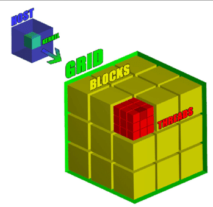
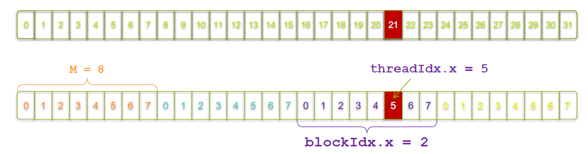
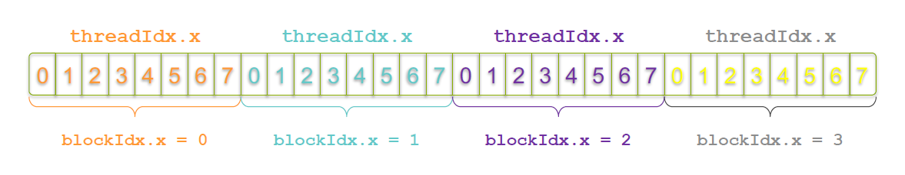

# Getting Started: Cuda C++

This chapter comprises of: 

1) GPU Intro. 
2) Transfer Of Data From CPU to GPU.
3) GPU Kernels.
4) Streaming Multiprocessor and GPU features. 
5) What are Threads, Blocks and Grids?
6) Writing our first program.
7) Cuda Error Checking.
8) Putting it all together: Vector Addition.

## GPU Intro

When a C++ program complied, the program is converted into machine code which can be executed on the CPU. When a program is written for CPU the machine code is excecuted sequentially inside a core. If there are multiple cores present then each core can be used to perform the desired operation parallely(using OpenMp in C++) but the instructions inside each core will be exceuted sequentially.  

Say if we want to add a vector A to vector B and assume only one core is present. Then each dim of A and B will be added sequentially.  
For example say vector A,B are 1x5.  
A = [1,  2, 3, 4, 5]  
B = [11,12,13,14,15] 

```
# Vector addition 
vector<int> A{1,2,3,4,5};
vector<int> B{11,12,13,14,15};
vector<int> C(5,0);

for(int i= 0;i<A.size();i++)
    C[i] = A[i] + B[i]; // sequential operation

```
Let's say the CPU takes t_cpu_add seconds to load the data into registers, add them, etc.  
The CPU will perform the addition of zeroth index first: 1 + 11 = 12 in 1\*t_cpu_add sec, then the addition of first index: 2 + 12 = 14 in 2\*t_cpu_add secs and so on sequentially.  
In total it will take 5\*t_cpu_add seconds. As you may have noted the addition in each index is independent of other indexes, so what if we want to do this operation at one clock cycle ie t_cpu_add seconds. This is where GPU is useful, it can perform the vector addition at a go(like boooom), that is parallely in 1\*t_gpu_add seconds. This is why GPUs are used, for parallel computing.
Note that t_cpu_add may be less than t_gpu_add, but when the dimensions of vectors are really large say 100,000, then 1\*t_gpu_add will be far less than 100,000\*t_cpu_add. 


*Cuda machine code is called SASS(streaming assembler). SASS is the opcode which is executed on the machine. PTX like a assembely language, Cuda C++/C is converted to PTX and then it is translated to into machine code which can be executed on the GPU.*


## Transfer Of Data from CPU to GPU.

Let's dive straight into how to perform vector addtion with a GPU. For this we need to load the data into the GPU first to perform any operations. GPU and CPU work together. We call the CPU as *Host* and the GPU as *Device*.

Just like we initialize memory in C++ program for CPU, we need to initialize memory in GPU.

```
// Memory allocation in C++

float *h_A; //h_ to represent host
int n = 10;
h_A = (float *)malloc(n*sizeof(float));
```

```
// Memory allocation in Cuda C++

float *d_A;
int n = 10;
CudaMalloc((void **)&d_A,n*sizeof(float));
```
**CudaMalloc()** is used to allocate memory(in global memory, more about this) in the GPU. It is very similar to *malloc()*. Notice here that we send the address of d_A. *I am guessing here, whatever memory is allocated in GPU its address is stored in d_A, hence we are passing the addres of d_A, so that in this address(d_A) we could store the address of GPU allocated memory's address.*  
Now lets transfer some data from host to device, that is from CPU to GPU here. This is done by using **cudaMemcpy()**
```
float *h_A; //Represents the memory in host(CPU)
float *d_A; //Represents the memory in device(GPU)
int n = 10;

h_A = (float *)malloc(n*sizeof(float)); // host memory allocation
CudaMalloc((void **)&d_A,n*sizeof(float)); //GPU memory allocation

for(int i = 0;i < n; i++)
    h_A[i] = i;

cudaMemcpy(d_A, h_A, n, cudaMemcpyHostToDevice); // transfer the data from CPU to GPU.
// the first parameter is the pointer to which the data is to be transfererd.
// the second parameter is the pointer to from which the data is to be transfererd.
// the amount of bytes to be transfered.
// cudaMemcpyHostToDevice for Host to device data transfer
// cudaMemcpyDeviceToHost for device to host data transfer

free(h_A);
cudaFree(d_A);
```
Note here that we have used *cudaFree()* to free the memory in the GPU. It is very similar to *free()* in C++ for CPU.

The below pic gives an idea of what happens when CudaMemcpy() is called.  


The data is transfered from the RAM of CPU to the DRAM of GPU. The DRAM of GPU is also called as global memory. This transfer of data is slow around 5-7 GB/s, so in terms of processing time, this is a costly operation.

How to copy data from device(GPU) to host(CPU) after we have performed some operations and we want the result in the CPU to display it? You guessed it right! using **cudaMemcpy()** but the third parameter is changed to cudaMemcpyDeviceToHost.

```
cudaMemcpy(h_A, d_A, n, cudaMemcpyHostToDevice); // transfer the data from GPU to CPU.
```

## GPU Kernels

Now we know how to transfer the data to the GPU. Lets see how to call a GPU to perform the desired operations on this data. 
To understand the GPU operations, it would helpful to think of a GPU consisting of many number of cores(this is not entirely true but for now it will help us to visulize. Will come back to this soon).
So instructions like add etc can be done on these cores parallely.  
To make use of these cores we need to write special functions called *kernel functions*. Whatever code is written iniside these *kernel functions* are executed on the GPU.
This is the syntax of *kernel functions*

```
__global__ void function_name(arguments){

}
```

The *\_\_global\_\_* indicates that the function runs on a GPU. The function call happens from the host code or other device code(when there are multiple GPUs present).  
Now I wrote *host code* above, what does it mean? The Cuda program has two parts.  
1) The code which is executed on CPU, are called host code. For example the main() function.
2) The code which is executed on GPU, are caled device code. Any function which has the *\_\_global\_\_* before it.

The Cuda compiler which is called *NVCC* separates the host code from device code. The host code is a normal C++ code, the device code are written inside these special functions mentioned before called *kernel functions*.

The GPUs has many number of cores, how do we specify how many number of cores are needed for our program? We do this while making the kernel function call inside the host code.

```
__global__ void add_vectors(arguments){
    ... //some code to add numbers 
}

int main(){
    ... // some code to allocate memory and initiallize the vectors.
    
    // kernel function call
    add_vectors<<<1,N>>>(arguments); // GPU function call, calling the kernel add_vectors().
    ..
}
```

Explanation:
```
int N = 100;
add_vectors<<<1,N>>>(arguments);

The triple angle brackets call the device code, in this case it calls add_vectors(). This is called kernel launch.
The parameters inside the triple angle brackets specify how many cores are needed for our program. So here we call 1*N cores to perform the vector add operation.
So when a kernel is launched, in each of the 1*N cores the function add_vectors() will execute parallely.
```

Combing the memory transfer and kernel launch.

```
__global__ void add_vectors(int *A, int *B, int *C,const int n){
    // some code to add the vectors A and B and store it in C, we will come back to this.
    // results stored in C
}

int main(){

int *h_A, *h_B, *h_C;// h_A and h_B input vectors. h_C to store results.
int *d_A, *d_B, *d_C;// For GPU memory allocation.

const int n = 100;
int size = n*sizeof(int);

// allocate memory in CPU (host)
h_A = (int*)malloc(size);
h_B = (int*)malloc(size);
h_C = (int*)malloc(size);

// allocate memory in GPU(device)
cudaMalloc((void **)&d_A, size);
cudaMalloc((void **)&d_B, size);
cudaMalloc((void **)&d_C, size);

// Copy inputs to device
cudaMemcpy(d_A, h_A, size, cudaMemcpyHostToDevice);
cudaMemcpy(d_B, h_B, size, cudaMemcpyHostToDevice);

// kernel launch with n number of cores.
add_vectors<<<1,N>>>(d_A,d_B,d_C,n);

// Note above that we are passing the pointers which refer to the memory address in the GPU. So it is d_A, d_B and d_C. 
// Passing h_A,h_B,h_C makes no sense as GPU will not have access to the memory in the CPU.

// d_C will store the result, which is in host(GPU). We need to copy it to CPU(device).
cudaMemcpy(h_C, d_C, size, cudaMemcpyDeviceToHost);

// Freeing the memory
free(h_A); free(h_B); free(h_C);
cudaFree(d_A); cudaFree(d_B); cudaFree(d_C);

}
```

## Streaming Multiprocessor and GPU features

Till now we have asssumed that GPU consists of many cores. Lets take a dive into what this means. 
GPU consists of what are known as SM, streaming multiprocessor. SM's are the building blocks of a GPU.  
A SM has various components, which are:  
1) **SP Units**: Single Precision Floating Point units. These are used to perform 32-bit floating point operations like add, multiply, sub and divide. Its like an ALU but is less capable than the standard ALU.
2) **DP Units**: Double Precision Floating Point units. These are used to perform 64-bit floating point operations like add, multiply, sub and divide. Its like an ALU but is less capable than the standard ALU.
3) **LD/ST units**: Load/Store units. Whenever a operation like Add is to be performed the operands are loaded into registers called Load units. The results are stored in resgisters called Store units. 
                    Whenever a operation is performed by the GPU it first Loads it and then stores the result in the store units.
4) **Wrap Scheduler**: Wrap scheduler simply put is the one which issues the instructions to the SM. It tells which instructions needs to be executed and when.
                    *Warp schedulers are dual issue capable*. This means that the wrap scheduler can issue two instructions to the same SM in the same clock, if the two instructions do not depend on each other.
5) **cc INT8 units**: Units to perform int8 operations.
6) **FP16 units**: 16-bit floating Point arithmetic units. From performance standpoint the speed of FP16 operations can be assumed to be twice the speed of SP operations.
7) **Tensor core unit**: [This NVIDIA article defines it better](https://www.nvidia.com/en-us/data-center/tensor-cores/)
8) There are others **BF16, FP8, INT8, FP6, FP4** etc.  

The below will give you a better picture.

  


## What are Threads, Blocks and Grids?

```
int N = 100;
add_vector<<<1,N>>>(arguments);
```
Previously,we assumed 1*N was the number of cores. Which is in fact not true. It is in fact *total number of threads*, here the word *total* is important.  

**Threads**: A thread represents the smallest unit of execution in a CUDA kernel. Each thread executes the kernel code independently and can be identified by its unique thread ID. Each SM has its feature as mentioned previously, thread can be viewed as an entity which executes an instruction(using the GPU features) dispachted by the wrap scheduler. Thread is the one which uses a DP unit or SP units or anything else inside a particukar SM.
In the above code *N* represents the number of threads in a Block.  

What is a Block?  
**Block**: A block is a group of threads. It is a collection of threads. A single SM executes one or more Block of threads.  
In the above kernel launch(*add_vector<<<1,N>>>(arguments)*), *1* represents the number of blocks inside a Grid.  

What is a Grid?  
**Grid**: A gourp of Blocks is called a Grid. It can be seen as a collection of SM.

```
Hierarchy
                Grids: A group of Blocks. In a kernel launch there is only one Grid.
                 ||
                 \/
                Blocks: A group of Blocks which make a Grid. A block is executed on a SM.
                 ||
                 \/
                Threads: Smallest entity, a gourp of Threads which make a Block. A thread uses the features of SM(Tensor cores, DP units etc) to execute an instruction.
```

```{note}
Threads, Blocks and Grids are more of a software concepts, but is also loosely linked with hardware part of GPU.
```

```
int threads_per_block = 32;
int blocks_per_grids = 64;
add_vector<<<threads_per_block,blocks_per_grids>>>(arguments);
```

In the above, there is one Grid(in a kernel launch there is always only one grid), which has *blocks_per_grids* number of blocks in it. Each Block has *threads_per_block* number of threads in it.  

**The Threads from a particular block can communicate with each other and share memory, but it cannot communicate nor share memory with threads belonging to another Block.**

A figure to help us understand Grid, Block and Thread.  
  
As the figure shows, a Grid can be viewed as a cube. It has 3 dimensions x,y and z. Each dimension of a grid is occupied by a group of blocks. A block can be viewed as a component of a Gird. A block also has 3 dimesnions. x,y and z. Each dimension of a block is occupied by a group of threads.  

But in the above code we did not specify 3 dimensions for number of blocks per thread and number of threads per block. It was just one. When only one number is specified by default it means x dimension. To specify blocks and threads in all three dimension we make use of *dim3* class.

```
dim3 blocks(1,2,3);     // A Grid will have 1 block in x dimension, 2 blocks in y and 3 blocks in z. 
dim3 threads(11,12,13); // A block will have 11 threads in x dimension, 12 threads in y and 13 threads in z dimension. 
add_vector<<<blocks,threads>>>(arguments);
```  

Now lets write our first cuda program.

## Writing our first program

Lets write a program to print the block co-ordinate within a grid and thread co-ordinate within a block. For this we need to know about the following:
1) **threadIdx.x** : gives us the x co-ordinate of a thread within a block. Respectively threadIdx.y and threadIdx.z gives us y and z co-ordinate of a thread within a block.
2) **blockIdx.x**  : gives us the x co-ordinate of a block within a grid. Respectively blockIdx.y and blockIdx.z gives us y and z co-ordinate of a block within a grid.
3) **gridDim.x**   : gives the number of blocks in the x dimesnion of the grid. Respectively gridDim.y and gridDim.y gives us the number of blocks in y and z dimesnion of a grid.
3) **blockDim.x**   : gives the number of threads in the x dimesnion of the block. Respectively blockDim.y and blockDim.y gives us the number of threads in y and z dimesnion of a block.

lets Launch a kernel of gird dim =(2,2), block dim = (2,2). Inside the kernel lets print the co-ordinate of the thread inside the block and co-ordinate of the block inside the grid.  
I would request you to write the program by yourself first.  

The below is the program.
```
#include <stdio.h>

__global__ void printcor(){
    printf("the grid dim is %d,%d.Blockdim is %d,%d. ThreadId and blockId are- thread x:%d,thread y:%d, block x:%d,block y:%d \n",gridDim.x,gridDim.y,blockDim.x,blockDim.y,threadIdx.x,threadIdx.y,blockIdx.x,blockIdx.y);
}

int main(){
dim3 grid(2,2);
dim3 block(2,2);
printcor<<<grid,block>>>();
cudaDeviceSynchronize(); // block until the GPU has finished its work
}
```   

Output of the above code is the below. Note that the threads in GPU might execute in any order, there will be nanosecond difference. So the output won't be necessarily "thread x:0 thread y:0, block x:0,block y:0".
```
the grid dim is 2,2.Blockdim is 2,2. ThreadId and blockId are- thread x:0,thread y:0, block x:1,block y:0 
the grid dim is 2,2.Blockdim is 2,2. ThreadId and blockId are- thread x:1,thread y:0, block x:1,block y:0
the grid dim is 2,2.Blockdim is 2,2. ThreadId and blockId are- thread x:0,thread y:1, block x:1,block y:0
the grid dim is 2,2.Blockdim is 2,2. ThreadId and blockId are- thread x:1,thread y:1, block x:1,block y:0
the grid dim is 2,2.Blockdim is 2,2. ThreadId and blockId are- thread x:0,thread y:0, block x:1,block y:1
the grid dim is 2,2.Blockdim is 2,2. ThreadId and blockId are- thread x:1,thread y:0, block x:1,block y:1
the grid dim is 2,2.Blockdim is 2,2. ThreadId and blockId are- thread x:0,thread y:1, block x:1,block y:1
the grid dim is 2,2.Blockdim is 2,2. ThreadId and blockId are- thread x:1,thread y:1, block x:1,block y:1
the grid dim is 2,2.Blockdim is 2,2. ThreadId and blockId are- thread x:0,thread y:0, block x:0,block y:0
the grid dim is 2,2.Blockdim is 2,2. ThreadId and blockId are- thread x:1,thread y:0, block x:0,block y:0
the grid dim is 2,2.Blockdim is 2,2. ThreadId and blockId are- thread x:0,thread y:1, block x:0,block y:0
the grid dim is 2,2.Blockdim is 2,2. ThreadId and blockId are- thread x:1,thread y:1, block x:0,block y:0
the grid dim is 2,2.Blockdim is 2,2. ThreadId and blockId are- thread x:0,thread y:0, block x:0,block y:1
the grid dim is 2,2.Blockdim is 2,2. ThreadId and blockId are- thread x:1,thread y:0, block x:0,block y:1
the grid dim is 2,2.Blockdim is 2,2. ThreadId and blockId are- thread x:0,thread y:1, block x:0,block y:1
the grid dim is 2,2.Blockdim is 2,2. ThreadId and blockId are- thread x:1,thread y:1, block x:0,block y:1
```  
Observe that *cudaDeviceSynchronize()* function is used here. This is because if CPU finishs it's work it won't wait for the GPU to finish, we have to explicity command the CPU to wait. cudaDeviceSynchronize() helps us to do this.  

## Cuda Error Checking  

It is a good practice to see if any of the cuda operations are throwing an error. For that we use the below code. 

```
void cuda_check(cudaError_t error, const char *file, int line) {
    if (error != cudaSuccess) {
        printf("[CUDA ERROR] at file %s:%d:\n%s\n", file, line,
               cudaGetErrorString(error));
        exit(EXIT_FAILURE);
    }
}

#define cudaCheck(err) (cuda_check(err, __FILE__, __LINE__))

int main(){
    .... // some code
    cudaCheck(cudaMalloc((void **)&d_A, sizeof(int)*10)); //checking if cuda memory allocation is successful or not.
}
```

## Putting it all together: Vector Addition

Let us add Vector A and B. Each thread in the kernel launch will perform the addition of only one index. So in total we will launch *N* threads, where *N* is the size of the array A and B.  
How do we get the index the array inside the thread?  
Let block 0 and its thread 0 be the index 0, block 0 and thread 1 be index 1, block 0 and thread 2 be index 2 and so on.  

For example, let N = 32. And Grid size be (4,0,0) and Block size be (8,0,0). In total we will have 32 threads covering *N*. Block 0 will cover array index from 0-7, block 1 will cover 8-15, block 2 will cover 16-23, block 3 will cover 23-31.  
For the 5th thread in block two to have index 21, we will use blockIdx.x, threadIdx.x and blockDim.x.
```
int index = threadIdx.x + blockIdx.x * blockDim.x;
```  

  

  


Putting it all together
```
#include <stdio.h>

__global__ void add_vectors(int *A, int *B, int *C,const int n){
    int index = threadIdx.x + blockIdx.x * blockDim.x;
    if(index < n)
        C[index] = A[index] + B[index];
}

void cuda_check(cudaError_t error, const char *file, int line) {
    if (error != cudaSuccess) {
        printf("[CUDA ERROR] at file %s:%d:\n%s\n", file, line,
               cudaGetErrorString(error));
        exit(EXIT_FAILURE);
    }
}
#define cudaCheck(err) (cuda_check(err, __FILE__, __LINE__))

int main(){

int *h_A, *h_B, *h_C;// h_A and h_B input vectors. h_C to store results.
int *d_A, *d_B, *d_C;// For GPU memory allocation.

const int n = 64;
int size = n*sizeof(int);

// allocate memory in CPU (host)
h_A = (int*)malloc(size);
h_B = (int*)malloc(size);
h_C = (int*)malloc(size);

for(int i = 0; i < n; i++)  
    {
        h_A[i] = i; h_B[i] = n + i;
    }

// allocate memory in GPU(device)
cudaCheck(cudaMalloc((void **)&d_A, size));
cudaCheck(cudaMalloc((void **)&d_B, size));
cudaCheck(cudaMalloc((void **)&d_C, size));

// Copy inputs to device
cudaCheck(cudaMemcpy(d_A, h_A, size, cudaMemcpyHostToDevice));
cudaCheck(cudaMemcpy(d_B, h_B, size, cudaMemcpyHostToDevice));

int threads_per_block = 32;

// kernel launch
add_vectors<<<(n + threads_per_block-1)/threads_per_block,threads_per_block>>>(d_A,d_B,d_C,n);

cudaCheck(cudaDeviceSynchronize()); // wait for GPU

// d_C will store the result, which is in host(GPU). We need to copy it to CPU(device).
cudaCheck(cudaMemcpy(h_C, d_C, size, cudaMemcpyDeviceToHost));


//printing results
for(int i = 0; i < n;i++)
{
    printf("%d + %d = %d\n",h_A[i],h_B[i],h_C[i]);
}

// Freeing memory
free(h_A); free(h_B); free(h_C);
cudaFree(d_A); cudaFree(d_B); cudaFree(d_C);

}
```

In the next chapter we will learn more about different types of memories inside the GPU, which will help us understand **Flash Attention** later on.

## Contribute
If you find any mistakes, kindly raise an issue to correct it. I am working, if there is any delay in my response I apologise.  
If you find this useful could you please give it a [star on GitHub](https://github.com/yogheswaran-a/cuda-notes/stargazers) and share it with others. Thank you!  
If you did not find this useful, sorry for wasting your time. The resources I have mentioned in my landing might help you learn.