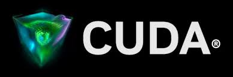

# Cuda C++: Crawling, Walking And Running



```{note}
Please note that I am not a subject matter expertise, whatever is written here is yet to be verified by someone is. These are my personal notes. 
```

## Little about myself and why I wrote this

When I got my hands on 8085 microprocessor, I just couldn't let it go. For the whole sem I played with it. I still remember the days when I was amazed/perplexed when I understood how NMOS, CMOS and BICMOS circuit work, when I designed logic circuits using MOS and CMOS technology, when I understood how multiplexers, memory, programmable logic cells, x86 instruction set etc (I forgot most of it, but I think in a month I will be able to learn it.)
But soon due to external factors, and the major I took while joining the college I had to pursue a carrer in Instrumentation and control(control systems is freaking amazing, instrumentation not so much). So I spent two years in energy industry until I finally decided that this was not for me, and began my journey as data scientist. 
After 2 years working on developing models, I stumbled upon the llm.c repo by Andrej Karpathy(Thanks for all the educational content, I owe you a lot). The pytorch does a lot of abstraction and I really didn't know what was going on inside, but I was always curious I didn't take any action to learn it. After checking the llm.c repo, I decided to do learn more about GPU programming, since I have always used NVIDIA GPUs, cuda was a defualt choice for me to know what is really going on behind all the python codes I had written.

So this is an attempt to document my learning about Cuda C++ in my free time and to give a glimpse of how good or bad I am.

## Acknowledgments
The following resources have helped me majorly,
1) [Main website](https://www.olcf.ornl.gov/cuda-training-series/), [Cuda-Training-Series - YT playlist](https://www.youtube.com/playlist?list=PL6RdenZrxrw-zNX7uuGppWETdxt_JxdMj).
2) [llm.c](https://github.com/karpathy/llm.c/).
4) [NVIDIA Blogs](https://developer.nvidia.com/blog/developer-blog-cuda-refresher-july-2020-updated/)
3) The Internet.

As I write each article I will provide the resources which helped to understand the concepts better.

## Pre-requisite
The readers should have basic C or C++ knowledge.

## Contribute
If you find any mistakes, kindly raise an issue to correct it. I am working, if there is any delay in my response I apologise.  
If you find this useful could you please give it a [star on GitHub](https://github.com/yogheswaran-a/cuda-notes/stargazers) and share it with others. Thank you!  
If you did not find this useful, I apologize for wasting your precious time. The resources I have mentioned above might help you learn.